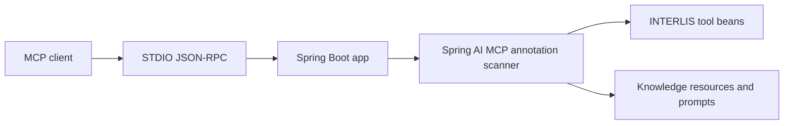

# interlis-mcp

`interlis-mcp` is a [Model Context Protocol (MCP)](https://modelcontextprotocol.io) server for generating, validating, analyzing, and reviewing INTERLIS 2 models. It runs over STDIO and is currently built with Spring Boot `4.1.0-M4`, Spring AI `2.0.0-M4`, Gradle `8.14.3`, and Java `21`.

## Overview
- STDIO-only MCP server for IDE agents and desktop MCP clients.
- Tooling for models, topics, classes, structures, associations, domains, geometry helpers, constraints, identifier hygiene, formatting, validation, structural analysis, modeling-rule checks, and local model-corpus search.
- MCP resources expose curated modeling rules, an agent workflow, and the configured `.ili` corpus index.
- MCP prompts provide reusable INTERLIS modeling, review, and extension workflows.
- Runtime verified against MCP protocol `2025-06-18`.
- Current initialize response advertises `tools`, `resources`, `prompts`, and runtime `logging`; completions are disabled.

## Architecture


## Quick Start
1. Ensure `java -version` reports Java 21.
2. Build the executable JAR:
   ```bash
   ./gradlew bootJar
   ```
3. Start the server:
   ```bash
   java -jar build/libs/interlis-mcp.jar
   ```

If multiple JDKs are installed, use the explicit Java 21 binary, for example `/path/to/java-21/bin/java -jar build/libs/interlis-mcp.jar`.

## Verification
```bash
./gradlew test
./gradlew e2eTest
```

## Docker
```bash
./gradlew buildAndPushMultiArchImage
docker run --rm -i interlis-mcp
```

Keep STDIN open and do not allocate a TTY.

## Client Setup
- Claude Desktop and VS Code examples are documented in [docs/USER_GUIDE.md](docs/USER_GUIDE.md).

## Developer Notes
- Build, test, runtime, and annotation-scanner details are documented in [docs/DEVELOPER_GUIDE.md](docs/DEVELOPER_GUIDE.md).

## License
[MIT](LICENSE)
