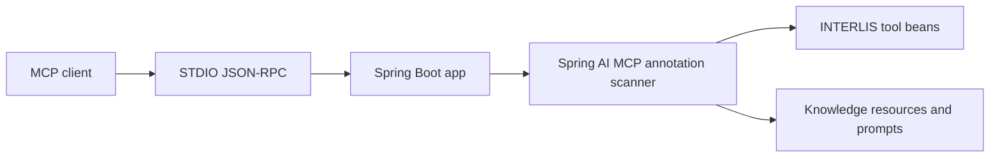

# interlis-mcp

`interlis-mcp` is a [Model Context Protocol (MCP)](https://modelcontextprotocol.io) server for generating, validating, analyzing, and reviewing INTERLIS 2 models. It runs over STDIO and is currently built with Spring Boot `4.1.0`, Spring AI `2.0.0`, Gradle `8.14.3`, and Java `21`.

## Overview
- STDIO-only MCP server for IDE agents and desktop MCP clients.
- Tooling for models, topics, classes, structures, associations, domains, geometry helpers, constraints, identifier hygiene, formatting, validation, structural analysis, modeling-rule checks, and local model-corpus search.
- High-level review tools combine compiler, structural and modeling-rule feedback for agentic workflows.
- MCP resources expose curated modeling rules, an agent workflow, a tool-choice guide, and the configured `.ili` corpus index.
- MCP prompts provide reusable INTERLIS modeling, review, and extension workflows.
- Compiler diagnostics can include a small `sourceExcerpt` around the reported line to support repair loops.
- Runtime verified against MCP protocol `2025-06-18`.
- Current initialize response advertises `tools`, `resources`, `prompts`, and runtime `logging`; completions are disabled.

## Agentic workflow
For a complete model without a before state, prefer `reviewIliModel` over separately calling `analyzeIliModel`, `checkModelingRules`, and `validateIliModel`. It compiles once and returns compiler diagnostics, structure, automated rule findings, manual checks, and open questions.

When changing an existing model, use `reviewIliChange` to compare the before/after model semantically. It compiles each version once, returns `added`, `removed`, `changed`, `potentiallyBreakingChanges`, and `impact`, and includes `afterCompilerValid`, `afterDiagnostics`, and an `afterReview` of the changed model. Together these form the final review gate for the unchanged after state; do not routinely run an additional `reviewIliModel` for that same state. If the model is edited again after `reviewIliChange`, run `reviewIliChange` again with the new after state.

For local examples, use `findSimilarModels` followed by `readModelExample` for the selected result. Search hits are discovery metadata; read the complete example before adopting a pattern.

The lower-level analysis, rule-checking, and validation tools remain available for targeted diagnostics when an agent needs one specific result. Generated association and role names are technical placeholders and remain open domain questions until confirmed.

## Architecture


## Quick Start
1. Ensure `java -version` reports Java 21.
2. Build the executable JAR:
   ```bash
   ./gradlew bootJar
   ```
3. Start the server:
   ```bash
   java -jar build/libs/interlis-mcp.jar
   ```

If multiple JDKs are installed, use the explicit Java 21 binary, for example `/path/to/java-21/bin/java -jar build/libs/interlis-mcp.jar`.

## Verification
```bash
./gradlew test
./gradlew e2eTest
```

The unit-test suite also contains deterministic agentic golden scenarios covering the intended high-level review workflow, including the two-compile `reviewIliChange` final gate, repair diagnostics, example lookup, breaking-change detection, and the rule that missing domain semantics must not be invented.

## Docker
```bash
./gradlew buildAndPushMultiArchImage
docker run --rm -i interlis-mcp
```

Keep STDIN open and do not allocate a TTY.

## Client Setup
- Claude Desktop and VS Code examples are documented in [docs/USER_GUIDE.md](docs/USER_GUIDE.md).

## Developer Notes
- Build, test, runtime, annotation-scanner, and eval details are documented in [docs/DEVELOPER_GUIDE.md](docs/DEVELOPER_GUIDE.md).

## License
[MIT](LICENSE)
