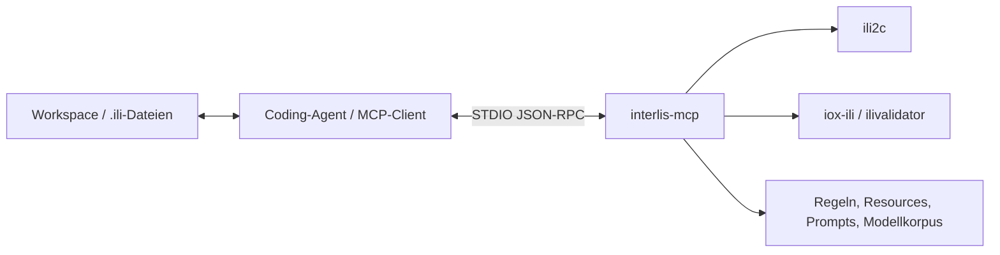

# Architektur

Dieses Dokument beschreibt die aktuelle technische Architektur von `interlis-mcp` und die wichtigsten Verträge zwischen MCP-Transport, INTERLIS-Compiler, Validator, Wissenskomponenten und agentischem Client.

## Systemgrenze

`interlis-mcp` ist ein **fachlicher MCP-Server**, kein allgemeiner IDE- oder Dateiserver.



Der Agent besitzt den Workspace. Er liest Dateien, übergibt vollständigen Modelltext an MCP-Tools und schreibt freigegebenen `updatedModelText` wieder in das Repository. `interlis-mcp` benötigt deshalb keine direkte Kopplung an VS Code, einen Language Server oder ein Dateisystem-Editing-Protokoll.

## Laufzeit

Die Anwendung ist eine nicht-webbasierte Spring-Boot-Anwendung.

Wichtige Eigenschaften:

- Java 21
- Spring Boot 4.1.0
- Spring AI 2.0.0
- STDIO-Transport
- synchroner MCP-Server
- Tools, Resources und Prompts aktiviert
- MCP-Completions deaktiviert

Die Registrierung der MCP-Schnittstellen erfolgt über den Spring-AI-Annotation-Scanner. Es gibt keine manuelle zentrale Tool-Liste im Produktivcode.

## Öffentliche MCP-Oberfläche

Die Oberfläche besteht aus drei Typen:

### Tools

Tools führen deterministische Arbeit aus oder liefern strukturierte Analyseergebnisse. Beispiele:

- `reviewIliModel`
- `reviewIliChange`
- `authorIliModel`
- `applyIliModelChanges`
- `generateIliConstraintCases`
- `authorIliMandatoryConstraint`
- `generateExampleXtf`

### Resources

Resources liefern stabile Wissensblöcke, beispielsweise:

- Modellierungsregeln,
- agentischen Arbeitsablauf,
- Tool-Auswahl,
- Constraint-Arbeitsablauf,
- Index des lokalen Modellkorpus.

### Prompts

Prompts geben einem Agenten aufgabenspezifische Arbeitsanweisungen, ohne dass jeder MCP-Client eine eigene vollständige Tool-Hierarchie pflegen muss.

Die exakte öffentliche Tool-Schemaoberfläche wird durch `ToolRegistrationContractTest` geschützt.

Modell-Repositories sind Serverkonfiguration (`interlis.mcp.model-repositories`) und kein wiederholter Parameter der Tool-Schemas. Das hält die öffentliche Oberfläche kleiner und verhindert, dass einzelne Agentenaufrufe beliebige Repository-Grenzen verschieben.

# Kompilierung als gemeinsame Grundlage

`IliCompilerService` kapselt ili2c und normalisiert Compilerresultate. Viele High-Level-Funktionen verwenden dieselbe Compilerabstraktion, statt eigene Parserpfade einzuführen.

Ein Compilation-Result enthält bei erfolgreicher Kompilierung die `TransferDescription`, die als typisierte Quelle für weitere Analysen dient.

Compilerdiagnosen des vom Benutzer übergebenen Modelltexts können zusätzlich einen kleinen `sourceExcerpt` mit Quellkontext erhalten. Meldungen, die zu importierten oder anderen Dateien gehören, werden nicht fälschlich mit einem Ausschnitt des Hauptmodells angereichert.

## Warum der ili2c-AST wichtig ist

Semantische Werkzeuge verlassen sich nicht auf String-Heuristiken, wenn der Compiler die benötigte Information bereits typisiert kennt.

Beispiele:

- `reviewIliChange` vergleicht analysierte Modellelemente.
- `applyIliModelChanges` löst alle Zielobjekte über dasselbe kompilierte Before-Metamodell auf.
- Constraint-Tools lesen echte ili2c-Constraint-Knoten und Pfade.
- `renameModelElement` arbeitet über das Metamodell und regeneriert anschliessend Modelltext.

# Modellanalyse und Reviews

## Einzelner Modellstand

`reviewIliModel` ist das High-Level-Gate für einen vollständigen aktuellen Modellstand.

```text
modelText
   |
   v
IliCompilerService  ----> Compilerdiagnosen
   |
   v
ModelAnalysisTools  ----> Struktur
   |
   v
ModelingRuleTools   ----> automatische Findings / manuelle Checks
   |
   v
reviewIliModel
```

Der Modelltext wird dabei einmal kompiliert. Nachgelagerte Auswertungen nutzen den kompilierten Zustand weiter.

## Vorher-/Nachher-Review

`reviewIliChange` kompiliert beide Stände jeweils einmal:

```text
Before -> compile -> analysis --\
                              semantic diff -> impact / breaking changes
After  -> compile -> analysis --/                  |
                                                 afterReview
```

`afterReview` wird aus dem bereits kompilierten Nachher-Modell erzeugt; für denselben Zustand ist keine dritte Kompilierung nötig.

# Source-preserving Modelländerungen

Bei source-preserving Änderungen soll möglichst wenig Originaltext verändert werden. Kommentare, Reihenfolge, Whitespace und Zeilenendungen ausserhalb der Einfügestelle bleiben erhalten.

`applyIliModelChanges` folgt vereinfacht diesem Muster:

```text
typisierter atomarer Änderungsbatch
        |
        v
Before kompilieren
        |
        v
Ziel im ili2c-Modell auflösen
        |
        v
exakte Einfüge- und Deklarationsstellen im Originaltext bestimmen
        |
        v
deterministisch gruppierte Patches anwenden
        |
        v
After kompilieren
        |
        v
semantischen Diff prüfen
```

`updatedModelText` wird nur freigegeben, wenn der semantische Diff zum gesamten verlangten Batch passt. Unerwartete zusätzliche Änderungen führen beispielsweise zu `UNEXPECTED_SEMANTIC_CHANGE`. Potenziell brechende Batches benötigen zusätzlich `allowPotentiallyBreaking=true`.

## Source-preserving ist nicht dasselbe wie Regeneration

`renameModelElement` verfolgt eine andere Strategie. Es nutzt das ili2c-Metamodell für ein robustes Rename und regeneriert danach das Modell. Das schützt die Semantik, kann aber Whitespace oder Deklarationslayout verändern.

Die beiden Werkzeugklassen erfüllen deshalb unterschiedliche Zwecke:

- `applyIliModelChanges`: möglichst kleine Quelltext-Patches plus atomarer semantischer Guard.
- `renameModelElement`: robuste modellweite Umbenennung, Formatierung darf sich ändern.

# Constraint-Architektur

Constraints besitzen eine eigene semantische Pipeline. Details zu den unterstützten Arten stehen in [CONSTRAINTS.md](CONSTRAINTS.md).

## Compiled Constraint Context

Ein aufgelöster Constraint-Kontext bündelt unter anderem:

- vollständigen Modelltext,
- erfolgreiches Compilerresultat,
- `TransferDescription`,
- ausgewählten ili2c-Constraint,
- constraint-level semantische IR.

Dadurch muss ein unverändertes Modell während Coverage, Solver, Objektgraph-Synthese und Validator-Fixture nicht immer wieder kompiliert werden.

## Semantische Repräsentationen

Je nach Constraint kommen verschiedene typisierte Ebenen zum Einsatz:

- constraint-level IR für MANDATORY, UNIQUE, EXISTENCE, PLAUSIBILITY und SET,
- `ConstraintExpression` für boolesche/skalar auswertbare Ausdrücke,
- Object-Set-IR für SET-Objektmengen wie `ALL` und navigierte Objektpfade,
- typisierte Pfadinformationen für Attribute und Navigation.

Nicht unterstützte Semantik wird nicht durch String-Heuristiken approximiert. Sie bleibt als expliziter nicht übersetzter oder nicht beweisbarer Fall sichtbar.

## Proof-Pipeline

```text
kompilierter Constraint
       |
       v
semantische IR
       |
       v
Coverage Planner
       |
       v
endlicher Goal Solver
       |
       v
ConstraintModelSynthesizer
       |
       v
modellbewusste Testobjekte / Links / Baskets
       |
       v
ConstraintTestTools
       |
       v
XTF
       |
       v
ilivalidator
```

Der interne Evaluator ist ein Hilfsmittel, nicht die finale Instanz. `generationVerified` oder `proofVerified` wird nur auf Grundlage der echten Validatorergebnisse freigegeben.

## Source-preserving Constraint-Authoring

Die typisierten Authoring-Tools verwenden dieselbe `IliConstraintSpec`-Hierarchie und den gemeinsamen `ConstraintAuthoringEngine`. Die JSON-Schemas bilden MANDATORY, UNIQUE, EXISTENCE, PLAUSIBILITY und SET als echte, über `kind` diskriminierte `oneOf`-Unionen ab; das gemeinsame Resultat publiziert auch die zwölf zulässigen Statuswerte als geschlossenes Enum. `ConstraintSourceEditService` gruppiert Constraint und abgeleitete Imports in einem source-preserving Patchsatz.

Der erfolgreiche Ablauf ist:

```text
Before-Compile
-> Constraint-Block rendern
-> source-preserving einfügen
-> After-Compile und Constraint auflösen
-> semantischen Roundtrip prüfen
-> Proof mit demselben kompilierten After-Kontext
-> semantischen Diff und afterReview aus Before/After ableiten
```

Damit besitzt das Authoring einen klaren Zwei-Compile-Vertrag.

# XTF-Infrastruktur

`XtfService` deckt allgemeine XTF-Erzeugung und -Validierung ab.

## `generateExampleXtf`

Die Generierung ist konservativ und deterministisch. Es werden nur Klassen und Pflichtwerte ausgegeben, die sicher erzeugt werden können. Nicht unterstützte Klassen werden in `skippedClasses` ausgewiesen, statt möglicherweise ungültige Platzhalter zu schreiben.

## `validateXtf`

Der Modelltext wird kompiliert und das übergebene XTF mit dem Validator geprüft. Fehler und Warnungen werden strukturiert gesammelt.

## Constraint-Fixtures

Constraint-Tests verwenden `TypedValueFixtureFactory` und `NavigationGraphSynthesizer` für skalare Werte, Referenz-OIDs, COORD, Linien-/Flächen-/Multigeometrien, eingebettete Strukturen, Association-Links und mehrere Baskets. Diese Infrastruktur erlaubt es, Proof-Fälle exakt auf eine erwartete Constraint-Verletzung auszurichten und andere Fixture-Fehler davon zu unterscheiden. Kann der installierte Validator eine Wertgleichheit nicht ausführen oder würde die Fixture bereits eine andere Modellregel verletzen, bleibt der Kandidat mit präzisem Reason-Code zurückgehalten.

# Multi-Basket-Semantik

Testobjekte können optional eine `basketId` tragen. Objekte desselben Topics und derselben ID werden in denselben Basket geschrieben.

Cross-Basket-Referenzen erhalten bei Bedarf `BID`. Damit können Scope-Unterschiede wie diese real geprüft werden:

```text
UNIQUE               -> global über Baskets
UNIQUE (BASKET)      -> getrennt pro Basket

SET CONSTRAINT       -> globale Objektmenge
SET CONSTRAINT (BASKET) -> getrennte Auswertung pro Basket
```

# Wissens- und Regelarchitektur

## Regelprofile

Kuratierte Regeln liegen als versionierte YAML-Ressourcen im Repository:

- `modeling-rules.core.yml`
- `modeling-rules.so.yml`

`CORE` ist portabel. `SO` erweitert `CORE` um Regeln des Solothurner Modellierungshandbuchs.

Jede Regel unterscheidet explizit zwischen automatischer und manueller Prüfung. Fachlich nicht deterministisch prüfbare Regeln bleiben `MANUAL`; der Server simuliert keine Gewissheit.

## Lokaler Modellkorpus

`ModelCorpusService` durchsucht die konfigurierten Pfade lokal und rekursiv nach `.ili`-Dateien. Die Suche ist:

- read-only,
- lexikalisch,
- in-memory,
- ohne Embeddings,
- ohne Netzwerkzugriff.

`readModelExample` darf nur Dateien innerhalb des konfigurierten Korpus lesen. Suchergebnisse sind Discovery-Metadaten; vollständiger Quelltext wird erst über dieses explizite Read-Tool geliefert.

# Fehler- und Sicherheitsprinzipien

## Keine erfundene Semantik

Wenn der Server oder Solver einen Fall nicht sicher bestimmen kann, wird dies als offene Frage, `coverageUnsolved`, Safety-Reason-Code oder anderer expliziter Fehlerzustand zurückgegeben.

## Compiler- und Validatorfehler nicht vermischen

Ein Constraint-Test unterscheidet:

- Fehler der Fixture oder des Modells,
- die erwartete gezielte Constraint-Verletzung.

Nur die gezielte Verletzung darf als erwarteter Counterexample gelten.

## Keine versteckten Seiteneffekte

Der MCP-Server schreibt keine Benutzerdateien und führt keine produktiven Datenbankoperationen aus. Temporäre Dateien für Compiler- und Validatoraufrufe sind interne Implementierungsdetails.

Modelltext ist auf 2 MiB, XTF auf 20 MiB und eine explizite Constraint-Suite auf 100 Fälle begrenzt. Temporäre Compilerpfade werden in öffentlichen Diagnosen als `<submitted-model>` normalisiert und Dateien in `finally`-Pfaden entfernt.

# Logging und STDIO

STDOUT ist für das MCP-Protokoll reserviert. Logging wird deshalb über STDERR geführt. `logback-spring.xml` reduziert unnötiges Framework-Logging, damit die Transportkommunikation sauber bleibt.

# Testarchitektur

Die Testschichten erfüllen unterschiedliche Aufgaben:

```text
Unit-/Semantiktests
       |
       v
Contract-Tests für MCP-Schemas
       |
       v
Golden Scenarios für Workflow-Verträge
       |
       v
STDIO-E2E gegen das gebaute JAR
```

Zusätzlich schützen Validator-Differentialtests die Übereinstimmung zwischen interner Constraint-Semantik und realem ilivalidator.

Die E2E-Tests starten das tatsächlich gebaute `interlis-mcp.jar` über STDIO. Damit werden nicht nur Java-Methoden, sondern auch Annotation-Scanning, JSON-Deserialisierung, MCP-Registrierung und Laufzeit-Wiring geprüft.

# Bewusste Architekturgrenzen

`interlis-mcp` soll ein fokussierter INTERLIS-Fachdienst bleiben. Insbesondere gehören folgende Verantwortungen nicht in den Server:

- allgemeines Workspace-Dateimanagement,
- IDE-spezifische Editierlogik,
- direkte Kopplung an einen bestimmten LSP-Client,
- fachliche Entscheidungen ohne Quelle,
- produktive DB- oder Deployment-Operationen.

Neue Funktionen sollten diese Grenze respektieren und möglichst vorhandene Compiler-, Review-, Source-Edit- und Proof-Infrastruktur wiederverwenden.
