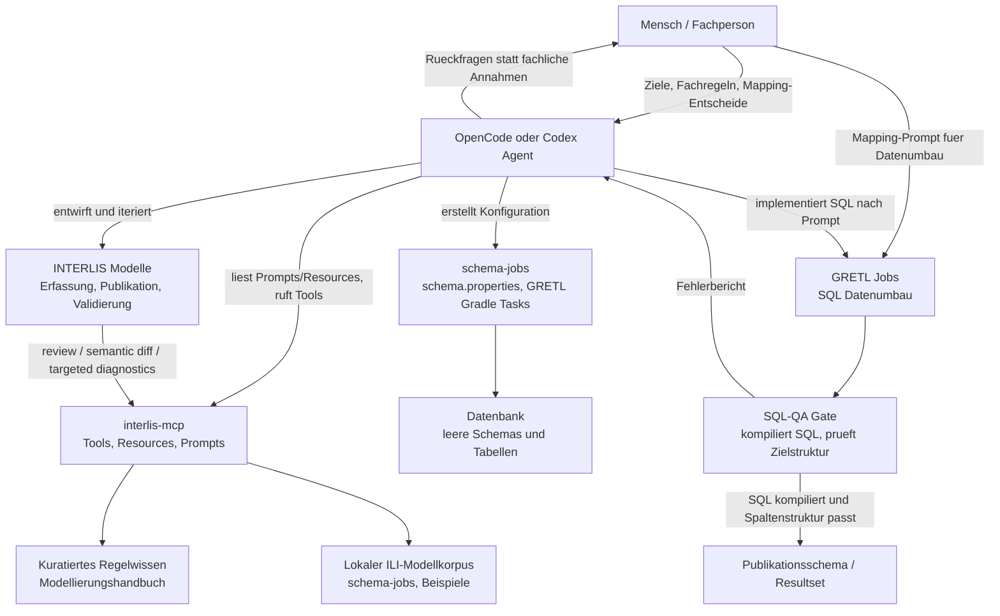

# Agentic Coding in der INTERLIS-Geodateninfrastruktur

## Zweck dieses Dokuments

Dieses Dokument konserviert Session-uebergreifendes Architektur-, Workflow- und Umsetzungskontextwissen fuer agentisches Arbeiten in einer INTERLIS-basierten Geodateninfrastruktur. Es soll in neuen ChatGPT-Codex-, OpenCode- oder anderen Coding-Agent-Sessions als Startpunkt dienen, damit die urspruenglichen Ideen nicht erneut rekonstruiert werden muessen.

Das Dokument ist eine strategische Roadmap, kein Implementierungsstatus. Es beschreibt Zielbild, Leitplanken, sinnvolle Agentenrollen und naechste Ausbauschritte ueber den aktuellen `interlis-mcp`-MVP hinaus.

Relevante OpenCode-Referenzen:

- [OpenCode Config](https://opencode.ai/docs/config/)
- [OpenCode Agents](https://opencode.ai/docs/agents/)
- [OpenCode Rules / Instructions](https://opencode.ai/docs/rules/)

## Was hier mit Agentic Coding gemeint ist

Agentic Coding ist in diesem Kontext mehr als Chatten mit einem LLM oder das Generieren einzelner INTERLIS-Snippets. Ein agentischer Workflow bedeutet, dass ein Coding-Agent ein fachlich-technisches Ziel ueber mehrere Schritte verfolgt, dazu passende Tools nutzt, Zwischenergebnisse prueft, Fehler autonom behebt und verbleibende fachliche Unsicherheiten explizit an einen Menschen zurueckspielt.

Fuer INTERLIS-Modellierung heisst das konkret:

- Der Agent sammelt zuerst Kontext: Modellzweck, bestehende Modelle, Konventionen, Modellierungshandbuch, lokale Beispiele und bekannte Zielsysteme.
- Der Agent entwirft oder erweitert Modelle iterativ statt in einem grossen unkontrollierten Schritt.
- Der Agent nutzt technische Werkzeuge konsequent: High-Level-Reviews fuer vollstaendige Modellstaende und Aenderungen, Snippet-Tools fuer lokale Konstruktion sowie gezielte Low-Level-Diagnostik bei konkretem Bedarf.
- Der Agent behandelt Compilerfehler, strukturelle Inkonsistenzen und Regelverletzungen als Arbeitsgegenstand und iteriert bis zu einem technisch belastbaren Modell.
- Der Agent erfindet keine fachliche Semantik: Kardinalitaeten, Rollen, Constraints, Datenumbau-Regeln, Joins und Mapping-Logik brauchen entweder eine Quelle oder eine menschliche Entscheidung.

Die Grenze ist wichtig: Technische Qualitaet kann und soll der Agent weitgehend autonom pruefen. Fachliche Bedeutung darf er nicht stillschweigend erfinden. Menschlicher Input bleibt insbesondere bei Datenumbau- und SQL-Mapping-Fragen Pflicht.

## Zielarchitektur

Die Zielarchitektur trennt drei Verantwortungen:

- `interlis-mcp` liefert Modellierungswissen, INTERLIS-Tools, Analyse, Regelchecks, Validierung und Korpus-Suche.
- `schema-jobs` erzeugt aus fertigen Modellen Datenbankschemas und leere Tabellen.
- GRETL-Jobs transformieren Daten zwischen Erfassungs-, Umbau- und Publikationsschemata, werden aber durch ein SQL-QA-Gate technisch geprueft.

Der geaenderte Schritt 5 ist bewusst kein vollautonomer Datenumbau. Der Agent soll SQL kompilieren und Resultset-Strukturen gegen Zieltabellen pruefen, aber fachliche Mapping-Entscheide bleiben beim Menschen.



## OpenCode-Konfiguration als Zielbild

Die folgende Konfiguration ist ein Zielbild, keine aktuell anzulegende Pflichtstruktur. Sie zeigt, wie OpenCode spaeter projektlokal konfiguriert werden koennte, damit neue Sessions automatisch die relevanten Roadmap-, Agenten- und Implementierungsdokumente laden koennen.

OpenCode unterstuetzt laut offizieller Dokumentation unter anderem:

- `instructions`, um wiederverwendbare Regel- und Kontextdateien einzubinden.
- `mcp`, um MCP-Server zu konfigurieren.
- `agent`, um spezialisierte Agenten mit Beschreibung, Modus und Berechtigungen zu definieren.
- `permission`, um etwa `edit`, `bash` und `webfetch` global oder agentenspezifisch zu erlauben, zu verbieten oder abzufragen.
- `command`, um wiederkehrende Arbeitsablaeufe als Slash-Commands bereitzustellen.

Ein spaeteres `.opencode/opencode.jsonc` koennte so aussehen:

```jsonc
{
  "$schema": "https://opencode.ai/config.json",
  "instructions": [
    "docs/agentic-interlis-roadmap.md",
    "docs/INTERLIS.agent.md",
    "docs/implementation/*.md"
  ],
  "mcp": {
    "interlis": {
      "type": "local",
      "command": ["java", "-jar", "build/libs/interlis-mcp.jar"],
      "enabled": true
    }
  },
  "agent": {
    "interlis-modeler": {
      "description": "INTERLIS Modelle entwerfen, analysieren, validieren und anhand kuratierter Regeln pruefen.",
      "mode": "all",
      "permission": {
        "edit": "ask",
        "bash": {
          "*": "ask",
          "git status*": "allow",
          "./gradlew test*": "allow",
          "./gradlew e2eTest*": "allow"
        },
        "webfetch": "ask"
      }
    },
    "schema-job-agent": {
      "description": "schema.properties und Gradle-Aufrufkontext fuer schema-jobs vorbereiten, ohne produktive DB-Aenderungen auszufuehren.",
      "mode": "all",
      "permission": {
        "edit": "ask",
        "bash": {
          "*": "ask",
          "git status*": "allow",
          "find *": "allow",
          "rg *": "allow",
          "./gradlew tasks*": "allow"
        },
        "webfetch": "deny"
      }
    },
    "gretl-sql-agent": {
      "description": "GRETL SQL nur aufgrund eines menschlichen Mapping-Prompts implementieren und offene Fachfragen markieren.",
      "mode": "all",
      "permission": {
        "edit": "ask",
        "bash": {
          "*": "ask",
          "git status*": "allow",
          "git diff*": "allow"
        },
        "webfetch": "deny"
      }
    },
    "gretl-sql-reviewer": {
      "description": "GRETL SQL gegen Datenbank kompilieren und Resultset-Struktur gegen Zieltabellen pruefen, ohne fachliches Mapping zu erfinden.",
      "mode": "subagent",
      "permission": {
        "edit": "deny",
        "bash": {
          "*": "ask",
          "git diff*": "allow",
          "git status*": "allow"
        },
        "webfetch": "deny"
      }
    }
  },
  "command": {
    "interlis-review": {
      "description": "INTERLIS Modell analysieren, Regeln pruefen und validieren.",
      "agent": "interlis-modeler",
      "template": "Reviewe das angegebene INTERLIS-Modell mit reviewIliModel und dem passenden Modellzweck. Berichte Compilerdiagnosen, automatisierte Findings, manuelle Checks und offene fachliche Fragen getrennt. Nutze Low-Level-Tools nur fuer gezielte Detaildiagnosen."
    },
    "sql-qa": {
      "description": "GRETL SQL kompilieren und Resultset-Struktur gegen Zieltabellen pruefen.",
      "agent": "gretl-sql-reviewer",
      "template": "Pruefe den angegebenen GRETL SQL-Umbau technisch. Kompiliere SQL gegen die Dev/Test-DB, pruefe referenzierte Tabellen und Spalten, vergleiche Resultset-Spalten mit der Zielstruktur und formuliere fachliche Unsicherheiten als Rueckfragen."
    }
  }
}
```

Wichtige Leitlinie fuer OpenCode: Diese Konfiguration soll konservativ starten. `git push`, produktive DB-Befehle, destruktive Shell-Kommandos, Migrationen und echte Datenveraenderungen sollen immer `ask` bleiben. Reine Lesekommandos, Statusabfragen und Tests koennen erlaubt werden, sofern sie keine produktiven Seiteneffekte haben.

## Die 5 Umsetzungsschritte

### Schritt 1: `interlis-mcp` als Agenten-Wissens- und Toolserver

Der erste Schritt ist ein agentenfaehiger `interlis-mcp`. Dieser Server soll nicht nur Snippets liefern, sondern dem Agenten Modellierungswissen und Pruefwerkzeuge bereitstellen.

Der aktuelle MVP umfasst bereits:

- MCP Resources fuer kuratierte Regeln, Agent-Workflow, Tool-Auswahl und lokalen Modellkorpus-Index.
- MCP Prompts fuer Modellierung, Review und kontrollierte Erweiterung.
- `reviewIliModel` als Standardreview fuer einen vollstaendigen Modellstand.
- `reviewIliChange` fuer semantische Vorher-/Nachher-Analyse inklusive Review des After-Modells.
- `analyzeIliModel` fuer gezielte strukturelle und semantische Modellanalyse.
- `listModelingRules` und `checkModelingRules` fuer Regelkatalog und gezielte automatisierte/manuelle Regelchecks.
- `validateIliModel` fuer gezielte ili2c-Compilerdiagnostik; Diagnosen koennen einen kleinen `sourceExcerpt` fuer Repair-Loops enthalten.
- `indexConfiguredModels`, `findSimilarModels` und `readModelExample` fuer lokale `.ili`-Beispielsuche und das vollstaendige Lesen ausgewaehlter Vorbilder.
- deterministische Golden-Scenario-Tests fuer den vorgesehenen agentischen Workflow, ohne LLM-Testframework.

Ziel ist, dass ein Agent bei jedem Modellierungsauftrag einen stabilen technischen Arbeitszyklus hat: Wissen laden, bei Bedarf Beispiele suchen und lesen, Modell erstellen oder erweitern, den vollstaendigen Stand mit High-Level-Reviews pruefen, technische Fehler iterativ beheben und fachliche Unsicherheiten offen lassen.

### Schritt 2: Agentenfaehiger Modellierungsworkflow

Der Standardworkflow fuer INTERLIS-Modellierung soll als Prompt, Dokumentation und spaeter eventuell als OpenCode-Command verfuegbar sein.

Der Agent soll:

1. Modellzweck klaeren: Erfassung, Publikation, Validierung oder unbekannt.
2. Fachbegriffe und offene fachliche Entscheidungen sammeln.
3. Aehnliche Modelle im lokalen Korpus mit `findSimilarModels` suchen und ein relevantes Vorbild mit `readModelExample` vollstaendig lesen.
4. Bei einem bestehenden vollstaendigen Modell den Ausgangsstand mit `reviewIliModel` erfassen.
5. Modell in kleinen Inkrementen erstellen oder erweitern.
6. Aenderungen an bestehenden Modellen mit `reviewIliChange` semantisch pruefen und den finalen Stand gemaess aktuellem Prompt mit `reviewIliModel` abschliessen.
7. `validateIliModel`, `analyzeIliModel` und `checkModelingRules` nur fuer konkrete Low-Level-Diagnosen einsetzen, nicht als routinemaessige Dreierfolge.
8. Automatisierte Fehler beheben, soweit sie technisch eindeutig sind; bei Compilerfehlern `sourceExcerpt` verwenden, wenn vorhanden.
9. Fachliche Luecken als Rueckfragen dokumentieren. Technisch generierte Namen oder fehlende Kardinalitaeten sind keine bestaetigten Fachentscheide.

Der Agent darf technische Form und Konsistenz verbessern, aber keine fachlichen Kardinalitaeten, Rollen, Constraints oder Klassenzuschnitte ohne Quelle festlegen.

### Schritt 3: Schema-Job-Agentik

Wenn das Erfassungs-, Validierungs- oder Publikationsmodell stabil ist, soll der naechste Agentenbaustein die Schema-Erzeugung unterstuetzen.

Ziel:

- Aus finalen `.ili`-Modellen eine passende `schema.properties` und optionale Konfigurationsdateien vorbereiten.
- Bestehende Konventionen aus `/Users/stefan/sources/schema-jobs` erkennen und wiederverwenden.
- Den passenden Gradle-/GRETL-Aufruf dokumentieren.
- Vor Ausfuehrung gegen echte Datenbanken klar zwischen Dry-Run, Dev/Test und produktiven Zielen unterscheiden.

Sicherheitsgrenze: Der Agent darf Konfigurationen vorbereiten und lokale Checks ausfuehren. Produktive DB-Aenderungen oder destructive schema operations duerfen nur mit expliziter menschlicher Freigabe laufen.

### Schritt 4: GRETL-Datenumbau mit menschlichem Mapping-Prompt

Der GRETL-Datenumbau ist fachlich zu offen, um ihn vollautonom zu erwarten. Es braucht fast immer menschliche Vorgaben:

- Welche Erfassungstabellen mappen auf welche Publikationstabellen?
- Welche Attribute werden direkt uebernommen?
- Welche Attribute werden transformiert, aggregiert oder aus anderen Schemas abgeleitet?
- Welche Joins, Filter, Prioritaeten und Sonderfaelle gelten?
- Welche bestehenden GRETL-Jobs sind Vorbilder?

Der Agent soll aus einem menschlichen Mapping-Prompt SQL und ein Testskelett ableiten. Er soll dabei unklare Fachlogik markieren, statt Annahmen zu verstecken.

Guter Input fuer diesen Schritt ist ein Prompt in dieser Art:

```text
Erstelle den GRETL-Datenumbau fuer Publikationstabelle pub_schema.gebaeude_solarkataster.

Quelle:
- erfassung.gebaeude_solarkataster.gebaeude
- av_avdpool_ng.gebaeudeadressen

Mapping:
- t_id wird neu erzeugt.
- egid kommt aus erfassung.gebaeude_solarkataster.gebaeude.egid.
- geometrie kommt aus erfassung.gebaeude_solarkataster.gebaeude.geometrie.
- bewilligungsverfahren wird aus status und gebaeudeart abgeleitet:
  ...

Offene Punkte:
- Falls mehrere AV-Adressen pro EGID existieren, bitte Rueckfrage stellen.
```

### Schritt 5: SQL-QA-Gate statt vollautonomer Datenumbau

Der geaenderte Schritt 5 ist ein technisches Qualitaetsgate, kein Ersatz fuer menschliches Fachmapping.

Der Agent soll mindestens pruefen:

- SQL ist syntaktisch kompilierbar.
- Referenzierte Schemas, Tabellen und Spalten existieren in der Dev-/Test-Datenbank.
- Das Resultset hat die erwarteten Spaltennamen.
- Resultset-Typen sind kompatibel mit der Ziel- oder Publikationstabelle.
- Fehlende Pflichtspalten, unerwartete Zusatzspalten und fragliche Nullability werden gemeldet.
- Kardinalitaet, Primary-Key-Logik und fachliche Eindeutigkeit werden als Warnungen oder Rueckfragen ausgewiesen, nicht still korrigiert.

Ein moeglicher QA-Ablauf:

1. SQL aus GRETL-Job extrahieren oder gezielt ausfuehrbaren Query-Block bestimmen.
2. Query mit `LIMIT 0` oder aequivalenter Technik gegen Dev/Test-DB kompilieren.
3. Datenbank-Metadaten fuer Zieltabellen lesen.
4. Resultset-Metadaten gegen Zielstruktur vergleichen.
5. Bericht als JSON und Markdown ausgeben.

Beispiel fuer einen QA-Bericht:

```json
{
  "sqlCompiles": true,
  "referencedObjectsExist": true,
  "targetTable": "pub_schema.gebaeude_solarkataster",
  "resultColumns": [
    {"name": "egid", "type": "integer", "compatible": true},
    {"name": "bewilligungsverfahren", "type": "text", "compatible": true}
  ],
  "missingTargetColumns": [],
  "unexpectedResultColumns": [],
  "warnings": [
    "Nullability von bewilligungsverfahren fachlich pruefen.",
    "Eindeutigkeit pro EGID nicht aus SQL-Struktur beweisbar."
  ],
  "manualQuestions": [
    "Was soll passieren, wenn mehrere Quellzeilen pro EGID existieren?"
  ]
}
```

Das Ziel ist ein Workflow, bei dem ein Mensch weiterhin das fachliche Mapping liefert, der Agent aber technische Fehler frueh findet und reproduzierbar dokumentiert.

## Wissensluecken und benoetigte Erweiterungen

Ein LLM kennt INTERLIS und GRETL nicht ausreichend projektspezifisch. Deshalb muss relevantes Wissen explizit und toolbar gemacht werden.

Benoetigtes Wissen:

- INTERLIS-Syntax, ili2c-Verhalten und Modellierungsidiome.
- SO-/GDI-spezifische Konventionen, zum Beispiel LV95/CHLV95, Metaattribute, Publikationsmodell-Flachheit und Normalisierungsentscheidungen.
- Modellierungshandbuch-Regeln als kuratiertes, versioniertes Regelset.
- Lokale Modellbeispiele aus `schema-jobs`, bestehenden Themen und produktiven Vorbildern.
- Struktur und Konventionen von `schema-jobs`, insbesondere `schema.properties`, Topic-Ordner, Gradle Tasks und DB-Zielschemata.
- GRETL-Projektstruktur, bestehende SQL-Jobs, Namenskonventionen und Testmuster.
- Datenbank-Metadaten fuer Quell- und Zielschemata.

Dieses Wissen soll nicht in riesigen Prompts versteckt werden. Besser sind:

- MCP Resources fuer stabile Wissensbloecke.
- MCP Tools fuer Analyse, Suche und Validierung.
- Kuratierte Markdown-Dateien fuer Agentenregeln.
- Lokale Repo-Suche ueber `rg` und gezielte Korpus-Tools.
- Kleine maschinenlesbare Reports statt langer unstrukturierter Antworten.

## Konkrete Folgearbeiten

Naheliegende Folgearbeiten nach dem aktuellen `interlis-mcp`-MVP:

- OpenCode-Projektkonfiguration als echte `.opencode`-Struktur anlegen, sobald die Agentenrollen praktisch getestet wurden.
- `interlis-mcp` um readonly Tools fuer schema-job-Kontext erweitern, zum Beispiel Schema-Job-Beispiele finden, `schema.properties` analysieren und Gradle-Tasks vorschlagen.
- Separates SQL-QA-Tool oder eigener MCP-Server fuer GRETL/DB-Metadaten evaluieren.
- Ein kleines End-to-End-Beispiel durchspielen: Modell entwerfen, validieren, Schema-Job vorbereiten, Mapping-Prompt schreiben, SQL generieren, SQL-QA-Bericht erzeugen.
- Regelset aus dem Modellierungshandbuch schrittweise erweitern und jede Regel klar als `AUTOMATED` oder `MANUAL` klassifizieren.
- Fuer GRETL-Jobs eine Prompt-Vorlage fuer menschliche Mapping-Vorgaben versionieren.
- Fuer SQL-QA einen minimalen Vertrag definieren: Input, DB-Verbindung, Zieltabellenname, Query, Output-JSON.

## Leitplanken

- Agenten duerfen technische Pruefungen automatisieren.
- Agenten duerfen fachliche Entscheidungen nicht erfinden.
- Agenten sollen unklare Semantik als Rueckfrage formulieren.
- Agenten sollen vorhandene Projektkonventionen lesen und uebernehmen, nicht neue Stile einfuehren.
- Produktive DB-Operationen, destruktive Befehle und Git-Publishing bleiben genehmigungspflichtig.
- Jede neue Architekturentscheidung soll in diesem Dokument oder in einer verlinkten Implementierungsdatei persistiert werden.
- Dieses Dokument soll kompakt genug bleiben, um in neuen Sessions gelesen zu werden, aber konkret genug, damit ein anderer Coding-Agent ohne lange Vorgeschichte weiterarbeiten kann.
